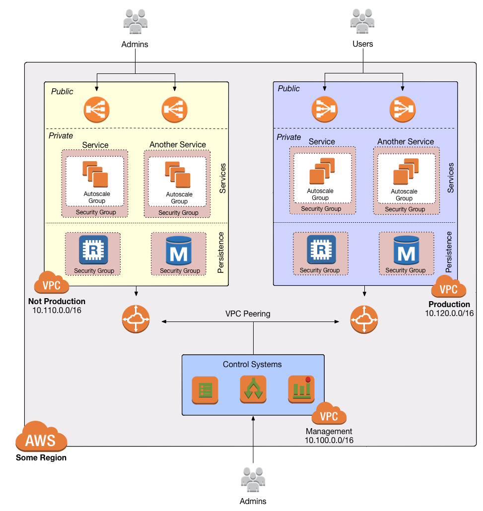
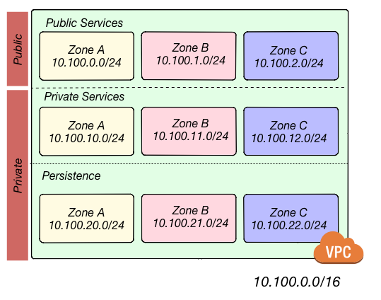
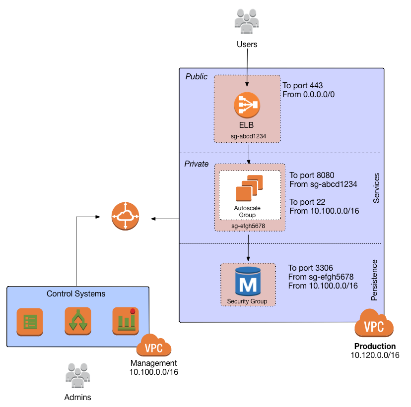

# Module Core Concepts

### What is a `VPC`?

Before VPCs existed in AWS, every EC2 Instance launched in AWS was addressable by the public Internet. You could block network access using security groups or OS-managed firewalls, but this still represented a security step backward from traditional data center setups where a given server would be unreachable from the Internet without a public proxy.

VPCs are fundamentally about isolating your networking resources so that they're only reachable by a limited set of other resources you define. You can set granular isolation rules by defining Route Tables for each Subnet. You can allow a limited set of outsiders to connect to your VPC, for example, using VPN (like OpenVPN or Strongswan), or just by exposing a single host accessible to the public through an AWS Elastic Load Balencer (ELB).

The general point is that you have an isolated environment you can use to lock down access.

Given all the above, an intuitive way to leverage a VPC is to make each VPC represent a unique environment by having,
for example:

* Development VPC [vpc-dev](/vpc-dev)
* Staging VPC [vpc-stage](/vpc-stage)
* Production VPC [vpc-prod](/vpc-prod)
* Management VPC [vpc-mgmt](/vpc-mgmt)

### CIDR-Formatted IP Address Ranges

Because a VPC is an isolated world meant specially for your use, you can define a range of private IP addresses that the VPC will allow. For example, we may wish to allow any IP address from 10.0.50.0 to 10.0.50.15.

But we need a more concise way to represent such an IP address range, and the de facto standard is the Classless Inter-
Domain Routing (CIDR) standard. The name is confusing but as [Wikipedia](https://en.wikipedia.org/wiki/Classless_Inter-Domain_Routing) explains, the concept works as follows:

1. Convert a base-10 IP like `10.0.50.0` to binary format: `00001010.00000000.00110010.00000000`

2. Decide how many binary digits (or bits) we will allow to "vary." For example, suppose I want the following range of IP
   addresses: `00001010.00000000.00110010.00000000` to `00001010.00000000.00110010.11111111` (`10.0.50.0` to `10.0.50.255`).
   Notice that the first three "octets" (group of 8 bits) are the same, but the last octet ranges from 0 to 255.

3. Express the number of varying bits in CIDR format: `<base-10-ip>/<leading-number-of-bits-which-are-fixed>`. For
   example, if we use the range in the previous step, we'd have `10.0.50.0/24`. The first 24 bits are fixed so that the
   remaining 8 bits can vary. In CIDR parlance, our "IP Address" is `10.0.50.0` and our "Network Mask" is `24`.

Sometimes CIDR Ranges are called CIDR Blocks. The CIDR Block `0.0.0.0/0` corresponds to any IP address. The CIDR Block
`1.2.3.4/32` corresponds to only `1.2.3.4`.

You'll notice that every VPC requires its own CIDR Block and this represents the range of private IP addresses
which can be assigned to resources within that VPC.

### Subnets

Subnets are "sub-networks", or a partition of the VPC. For example, a VPC might have the CIDR range `10.0.50.0/24` (`10.0.15.0` - `10.0.15.255`) and a subnet might allow just IP addresses in the range `10.0.50.0/28` (`10.0.15.0` - `10.0.15.16`). Note that subnets cannot have overlapping CIDR Ranges with other subnets.

In addition, each subnet **can** have a unique Route Table.

For example:

* Public Subnet [subnet-public](/subnet-public)
    * Used for Web Servers and Proxies
* Private Subnet [subnet-private](/subnet-private)
    * Used for Applications
* Database Subnet [subnet-data](/subnet-data)
    * Used for Databases and Search Indexes

### Route Tables

Each subnet needs a [Route Table](http://docs.aws.amazon.com/AmazonVPC/latest/UserGuide/VPC_Route_Tables.html) so that
it knows how to route traffic within that subnet. For example, a given subnet might route traffic destined for CIDR Block `10.0.20.0/24` to a VPC Peering Connection or VPN. Private subnet would use `10.0.10.0/24` only accessible from within the VPC, and the Public subnet (`0.0.0.0/0`) to the Internet Gateway so it can reach via the public Internet. The Route Table declares all this.

### The Internet Gateway

The best way to think of an [Internet Gateway](http://docs.aws.amazon.com/AmazonVPC/latest/UserGuide/VPC_Internet_Gateway.html)
is that it's the destination that VPC egress traffic destined for the public Internet gets routed to. It's configuration is recorded in a Route Table.

### NAT Gateways

If you launch an EC2 Instance in one of the **Public Subnets** defined above, it will automatically be addressable from the public Internet and have outbound Internet access itself.

But if you launch an EC2 Instance in one of the **Private Subnets** defined above, it will NOT be addressable from the public Internet. This is a useful security property. For example, we generally don't want our middleware or databases directly addressable on the public Internet.

But what if an EC2 Instance in a private subnet needs *outbound* (egress) Internet access? It can route its requests to the Internet, but there's no way for the Internet to return the response since, as we just explained, the EC2 Instance isn't addressable from the Internet.

To solve this problem, we need our private EC2 Instance to submit its public Internet requests through another EC2 Instance that's located in a public subnet. That EC2 Instance should keep track of where it got its original request so that it can redirect or "translate" the response it receives back to the original requestor.

Such an Instance is called a "Network Address Translation" instance, or NAT instance.

But what if the NAT Instance goes down? Now our private EC2 Instance can't reach the Internet at all. That's why it's preferable to have a highly available NAT Instance service, and that's what Amazon's [NAT Gateway](http://docs.aws.amazon.com/AmazonVPC/latest/UserGuide/vpc-nat-gateway.html)
service is. Amazon runs more than one EC2 Instance behind the scenes, and automatically handles failover if one instance dies.

### VPC Endpoints

By default, when an EC2 Instance makes an AWS API call, that HTTPS request is still routed through the public Internet.

AWS customers complained that they didn't want their AWS API requests traveling outside the VPC, so AWS released a [VPC Endpoint](http://docs.aws.amazon.com/AmazonVPC/latest/UserGuide/vpc-endpoints.html) service.

VPC Endpoints cost nothing and provide a new destination for a Route Table so that when certain AWS API requests are made instead of being routed to the public AWS API endpoint, they are routed directly within the VPC.

